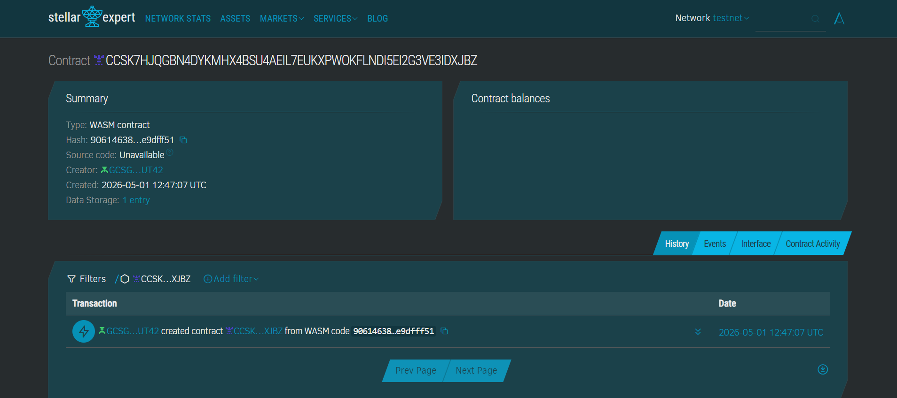

# BudgetJar
**Automated "Envelope" Budgeting & Enforced Savings on Stellar.**

---

## ## Project Description
BudgetJar is a decentralized money management tool designed to bring the traditional "envelope budgeting" method to the blockchain[cite: 1]. For workers in cash-heavy economies, managing daily liquidity while trying to save for the future is a constant struggle[cite: 1]. BudgetJar automates this discipline by partitioning stablecoin deposits into virtual "Jars" based on pre-set percentages[cite: 1]. By using on-chain logic, it enforces financial boundaries, such as time-locking savings to prevent impulsive spending[cite: 1].

## Problem
Maria, a domestic worker in Manila earning ₱15,000/month in cash, has no way to separate her income into savings, bills, and daily spending—resulting in frequent shortfalls before payday and zero emergency buffer[cite: 1].

## Solution
BudgetJar lets Maria deposit pesos (converted to USDC via local anchor), then auto-splits funds into on-chain "jars" (Soroban-enforced sub-accounts) with withdrawal rules—Stellar's sub-second finality and near-zero fees make micro-allocations economically viable[cite: 1].

## ## Project Vision
Our vision is to bank the unbanked by providing a high-fidelity financial discipline tool that feels as simple as a physical jar but carries the security and global accessibility of the Stellar network[cite: 1]. We aim to turn every smartphone into a sophisticated personal CFO[cite: 1].

## ## Key Features
* **Automatic Splitter:** Instantly divides deposits into custom-weighted categories[cite: 1].
* **Enforced Savings Lock:** Smart-contract-level protection that prevents access to savings until a 30-day maturity period is reached[cite: 1].
* **Emergency Unlock:** Allows for liquidity in true crises by applying a configurable penalty fee to early withdrawals[cite: 1].
* **Micro-transaction Friendly:** Leverages Stellar’s low fees to allow for frequent, small deposits[cite: 1].

## ## Contract Details
* **Network:** Stellar Testnet[cite: 1]
* **Contract ID:** `CCSK7HJQGBN4DYKMHX4BSU4AEIL7EUKXPWOKFLNDI5EI2G3VE3IDXJBZ`
* **Wasm Hash:** `[Insert your WASM hash here]`[cite: 1]



## ## Future Scope
* **AI Spending Insights:** Integrate AI to analyze jar usage and suggest optimal split percentages[cite: 1].
* **Anchor Integration:** Direct integration with Philippine Peso (PHP) anchors for local convenience store cash-ins[cite: 1].
* **Community Jars:** Shared jars for family groups to contribute to a single "Education" or "Emergency" fund[cite: 1].
* **Offline Mode:** Support for signed offline transactions that sync once connectivity is restored[cite: 1].

---

## Stellar Features Used
* **USDC Transfers:** Stable value storage for daily budgeting[cite: 1].
* **Soroban Smart Contracts:** Logic for jar allocation and lock-up enforcement[cite: 1].
* **Trustlines:** Secure handling of custom assets[cite: 1].

## Prerequisites
* Rust & Cargo[cite: 1]
* Soroban CLI v21.0.0+[cite: 1]

## How to build
```bash
soroban contract build
```[cite: 1]

## How to test
```bash
cargo test
```[cite: 1]

## How to deploy
```bash
soroban contract deploy --network testnet --source-account YOUR_KEY --wasm target/wasm32-unknown-unknown/release/budget_jar.wasm
```[cite: 1]

## Sample CLI Invocation
```bash
soroban contract invoke --id [YOUR_CONTRACT_ID] --source-account [USER_KEY] --network testnet -- deposit --user [USER_ADDRESS] --amount 1000000000
```[cite: 1]

## License
MIT[cite: 1]